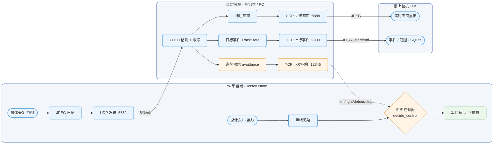

<h1 align="center">🚲 Multi-Terminal Vision Car</h1>

<p align="center">
  <b>多端协同视觉避障与远程控制系统</b><br>
  动量轮自平衡自行车 · 课程项目三
</p>

<p align="center">
  
  
  
  
  
</p>

---

## 📖 简介

一套由 **上位机(Qt) — 运算端(YOLO) — 部署端(Jetson Nano)** 组成的三端系统，用「**UDP 视频 + TCP 指令**」贯通成端到端闭环：

> 摄像头采集 → 远程传输 → 行人检测与跟踪 → 避障决策 → 设备控制

- 本仓库为旧项目的**重构整编版**：清晰命名 · 可直接运行 · git 管理
- 上位机**响应式两列卡片布局**，支持**浅色 / 暗色主题**实时切换（`CAR_THEME=dark` 可强制暗色）
- 三端均可独立编译 / 运行，任一端未启动不影响其它端（连接自动重连）

## 🎨 系统数据流



> **图例**：🔵 数据 / 视频 · 🟠 决策 / 控制 · 🟢 部署输出；实线 = 数据流，虚线 = 控制指令回流。
> 端口与指令集详见 [docs/protocol.md](docs/protocol.md)；完整架构见 [docs/architecture.md](docs/architecture.md)。

## 📦 目录结构

```
├── deployment/        # 部署端（Jetson Nano 车端，Python）
│   ├── vision/        # 黑线循迹
│   └── device/        # 串口桥接（真串口 / Mock）
├── server/            # 运算端（笔记本/PC，Python）
│   ├── net/           # 帧收发 + 指令分发
│   └── vision/        # 避障决策 + 帧源
├── host/              # 上位机（Windows Qt Widgets C++）
│   └── src/           # main / widget / tcp / udp / message_store
├── docs/              # 架构 / 协议 / 已知问题
└── tools/             # 冒烟测试等
```

## ✨ 功能特性

| 端 | 能力 |
|---|---|
| **上位机** | UDP 视频显示 + TCP 指令/事件双通道 · 截图自动入库（SQLite）· 响应式两列卡片 + 明/暗主题 · qmake / CMake 双构建路径 |
| **运算端** | 四种帧源（`udp`/`webcam`/`video`/`synthetic`）· YOLO 检测+跟踪 · 左/中/右避障决策 + 节流 · 目标生命周期事件 |
| **部署端** | 图传 + 循迹 + 指令服务三线程 · 中央控制器统一串口下发 · 串口抽象（真串口 / `SERIAL_PORT=mock`）· 可选 `NANO_TOKEN` 鉴权 |

## 🚀 快速开始

### 1. 上位机（Windows Qt）

```
cd host
qmake host.pro && make          # 或用 Qt Creator 打开 host.pro 构建
```

启动后点击 **“开启监听”**（TCP `9999` / UDP `8888`）。前提：安装 Qt 5/6 的
`core gui widgets network sql` 模块（**无需 OpenCV**）。

**VS Code + CMake（可选）**：仓库自带 `host/CMakeLists.txt`（与 `host.pro` 等价）。
Windows 上一口气装 Qt + 编译器的省事做法（MSYS2 · **UCRT64** 终端）：

```
pacman -S --needed mingw-w64-ucrt-x86_64-qt6-base mingw-w64-ucrt-x86_64-gcc mingw-w64-ucrt-x86_64-cmake mingw-w64-ucrt-x86_64-ninja
```

装好后在 VS Code 打开仓库、给 Qt 扩展选 **Qt6-MinGW** kit；或命令行：

```
cd host
cmake -S . -B build -G Ninja && cmake --build build
```

### 2. 运算端（笔记本 / PC）—— 缺 GPU 也能跑（CPU 慢一点）

```
pip install -r server/requirements.txt
python -m server.vision_server --source synthetic --show   # 无硬件 demo
```

`--source`：`udp`（nano，默认）/ `webcam` / `video`（配 `--input <file>`）/ `synthetic`（合成帧）。
首次运行会下载 ultralytics 权重 `yolov8n.pt`。

### 3. 部署端（Jetson Nano）

```
pip install -r deployment/requirements.txt
python -m deployment.nano_car                     # 真机（串口 /dev/ttyTHS1）
SERIAL_PORT=mock python -m deployment.nano_car    # 无硬件联调（只打印串口）
```

## 🧪 一条命令跑通整条链路（无需实体车）

终端 A：上位机启动并点“开启监听”；终端 B（合成帧源）：

```
python -m server.vision_server --source synthetic
```

运算端连上位机 `9999` 回传播口标注画面，目标进出触发 `ID_xx_start/end` → 上位机截图入库；
避障动作发往 nano 链路（未接线则打印重连日志）。部署端不启动也完全不影响演示。

## ⚙️ 配置与联调

所有网络 / 串口 / 模型参数均可用**环境变量**覆盖，不必改代码：

| 变量 | 默认 | 作用 |
|---|---|---|
| `SERVER_IP` | `192.168.87.77` | 运算端地址 |
| `NANO_IP` | `192.168.87.102` | 部署端地址 |
| `QT_IP` | `127.0.0.1` | 上位机地址（同机回环） |
| `SERVER_VIDEO_PORT` | `5552` | nano → 运算端视频 UDP |
| `NANO_CMD_PORT` | `12345` | 运算端 → nano 指令 TCP |
| `HOST_CMD_TCP` | `9999` | 运算端 ↔ 上位机指令 TCP |
| `HOST_VIDEO_UDP` | `8888` | 运算端 → 上位机视频 UDP |
| `SERIAL_PORT` | `/dev/ttyTHS1` | 设 `mock` 则用日志伪串口 |
| `MODEL` | `yolov8n.pt` | ultralytics 权重 |
| `NANO_TOKEN` | 空 | 两端一致时启用 `AUTH` 鉴权 |
| `CAR_THEME` | — | `dark` 强制暗色主题 |

## 🛠️ 技术栈

| 端 | 技术 |
|---|---|
| 部署端 | Python · OpenCV · socket · pyserial · threading |
| 运算端 | Python · ultralytics(YOLO) · OpenCV · numpy · socket · threading |
| 上位机 | C++ · Qt 6/5（Widgets / Network / SQL）· SQLite |

## 📄 License

本项目基于 [MIT](LICENSE) 许可开源。版权归属见 [LICENSE](LICENSE)。
